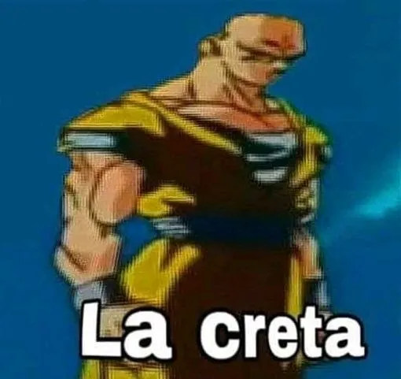

   

# FamilyBussiness-ExpoGo
familybussiness ahora en expo go

# Mi primer commit en este proyecto
#### cree el proyecto hoy 6/11/25
-------------------
# Estructura Inicial del Proyecto
1. Components
2. Screens
3. Services
4. Utils

## Components:
#### en components se encontrarán todos los componentes reutilizables
--------------------

## Screens:
#### screens funciona  para pantallas
--------------

## Services:
#### services funciona para servicios y lógica de negocio
--------------------

## Utils:
#### utils es para funciones utilitarias
----------------------

# Control de versiones

#### dentro del proyecto existen diferentes ramas como principalmente **main**, a partir de main sigue **test**, a partir de test, **dev** a partir de dev se  crea otra **rama para cada integrante del equipo**: (dev-nombre-estudiante)

### cree el proyecto hoy 6/11/25
-------------------
